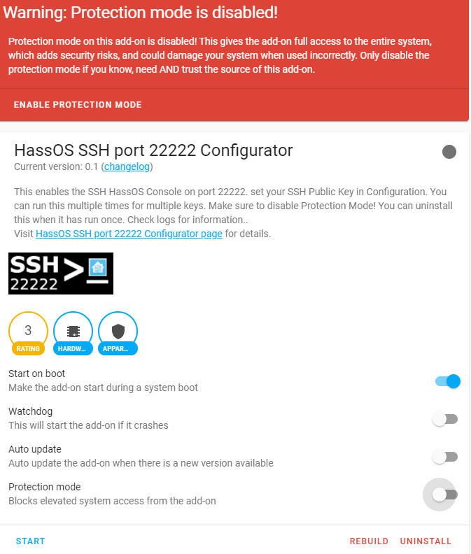

# Addon Repository
This an addon repository for HassOS Configurator projects.  These projects perform configuration tasks.<br>

All projects require a reboot and may be uninstalled after the first successful run.  Please observe logs to determine if the run was successful. 

## HassOS I2C Configurator
Enables the Raspberry Pi Serial Bus. 

## HassOS Serial Configurator
Enables the Raspberry Pi 4 Serial Port. Instead of Device Mode, the port becomes Host Mode for utilization by the Operating System.

## HassOS SSH port 22222 Configurator
Places an authorized_keys file in the location required by HassOS at boot time to enable the SSH port 22222. 

# Installation
Within Home Assistant, click Supervisor-> Add-on Store -> … button (in top left)-> Repositories. Add this repository. 

Click one of the items and install.<br>


# Info
You will need to disable Info-> Protection Mode for these Add-Ons.



# Configuration
Currently, only HassOS SSH Port 22222 Configurator requires configuration. Copy your public key into the configurator in a single line as such

```
SSHKey: "ssh-rsa AAAAB3NzaC1yc2EAAAADAQABAAABAQDGTlRAfhm9BIV6l6sOubRgeCY0wRhYQVfB3QBWFl2ELpeAnTHwRYY+4pSP1Nu7FuZqAzDyZkssmFkbXHJGqi6EAnAkRLsKhzvDKo5WSXfEQdl2kSN5bgU/e37GfwqG4ChEfY56gwu+tdHtt4eIrzKpmUKqFZWJaGoeI9sHptQR9QNitEsm0krkOcK0VLFLTeau+HOO1A4plcLjBB9Y43SFjth/Ouke+DVGaBO2LYNc8U0S4EiHT6KdRXS4iIwYjXMw6SEsT7eP9IWQObQ4ZgyG0cHO/6ArxJ0fyOcAI29sLzM9466ID0mTaJWHriTRf6Lxhpdd/S30VTG0JMTdo/Fj  root@HLAB-A17"
```
After saving, Home Assistant may change your input to look like this


# Operation
Hit the start button and observe the logs.  You may uninstall the Add-On when complete. 